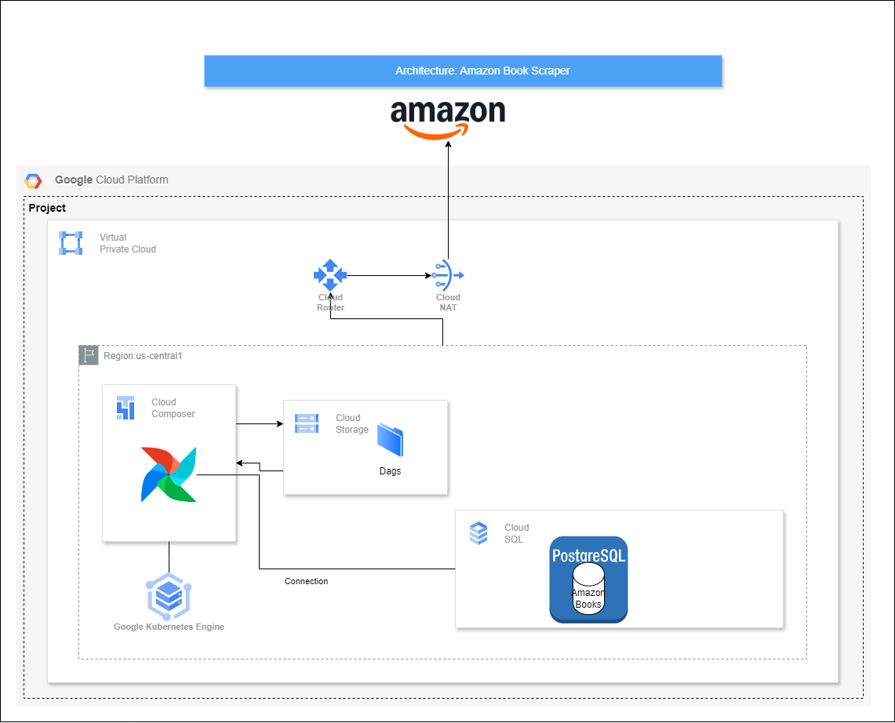

# Amazon Book Scraper and Storage
## Project Overview

The Amazon Book Scraper and Storage project is an automated data pipeline that scrapes book information from Amazon and stores it in a PostgreSQL database. The project leverages Apache Airflow for orchestration and scheduling of the scraping and data ingestion process.

## Table of Contents

<ol>
  <li>Project Overview</li>
  <li>Architecture</li>
  <li>Features</li>
  <li>Technologies Used</li>
  <li>Setup and Installation</li>
  <li>Usage</li>
</ol>

## Architecture

The project follows a simple ETL (Extract, Transform, Load) architecture:

1. <strong>Extract:</strong> Data is scraped from Amazon using a Python script with `requests` and `BeautifulSoup`.
2. <strong>Transform:</strong> The extracted data is cleaned and structured using `pandas`.
3. <strong>Load:</strong> The structured data is inserted into a PostgreSQL database using `airflow.providers.postgres.hooks.postgres`.

### High-Level Architecture Components:
1. **Airflow DAG:** Manages and schedules the daily data pipeline tasks.
2. **Python Scraper:** Extracts book data (title, author, price, rating) from Amazon.
3. **PostgreSQL Database:** Stores the scraped book data.
4. **Google Cloud Composer:** Manages the Airflow orchestration in a cloud environment.

## Features
- **Automated Daily Scraping:** The pipeline runs daily, automatically scraping new book data.
- **Data Deduplication:** Ensures only new books are added during each subsequent run.
- **Cloud-Based Orchestration:** Uses Google Cloud Composer for cloud-based execution and management.
- **Modular Design:** Components are decoupled, making it easy to extend or modify parts of the pipeline.

## Technologies Used
- **Apache Airflow:** Orchestrates and schedules the tasks.
- **Python:** Implements the scraping logic using requests and BeautifulSoup.
- **PostgreSQL:** Stores the book data for further analysis.
- **Google Cloud Composer:** Manages the Airflow environment on Google Cloud.
- **Terraform:** Automates the infrastructure setup.

## [Setup and Installation](INSTALLATION.md#installation-guide)
## Usage
- The project runs on a daily basis, ensuring the database is updated with new book entries.
- Can be used for trend analysis, pricing insights, or recommendation systems.
